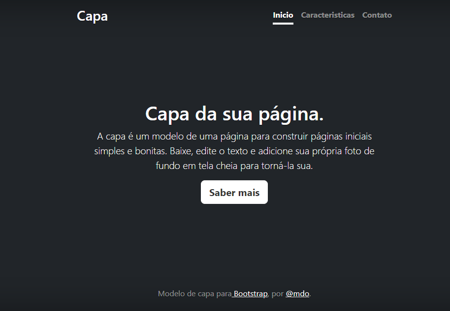

# Índice 

[Projeto - Portifolio para escrita do README](#projeto---portifolio-para-escrita-do-readme)  
[Descrição](#descri%C3%A7%C3%A3o)  
[Funcionalidades](#funcionalidades)  
[Tecnologias utilizadas](#tecnologias-utilizadas)  
[Fontes consultadas](#fontes-consultadas)  
[Autores](#autores)  

#  🚀 Projeto - Portifolio para escrita do README

## 📋 Descrição
Projeto usado durante as aulas para fazer um README e tambem utilizando Bootstrap de exemplo de página.

##  🔧 Funcionalidades
É um modelo de página simples e bonito que tem tres funções inicio, caracteristicas e contato que trazem informações.

### 🛠️ Tecnologias utilizadas
Foi utilizado:
. GitHub  
. Vscode  
. HTML  
. CSS  
. Bootstrap  

## 📄 Fontes consultadas 
[Um modelo para fazer um bom README.md](https://gist.github.com/lohhans/f8da0b147550df3f96914d3797e9fb89)  
[Exemplo de como escrever um README:](https://www.alura.com.br/artigos/escrever-bom-readme)  
[Bootstrap](https://getbootstrap.com/)

## ✒️ Autores
Larissa Manrique
[GitHub](https://github.com/larissassk)  
Leonardo Rocha 

